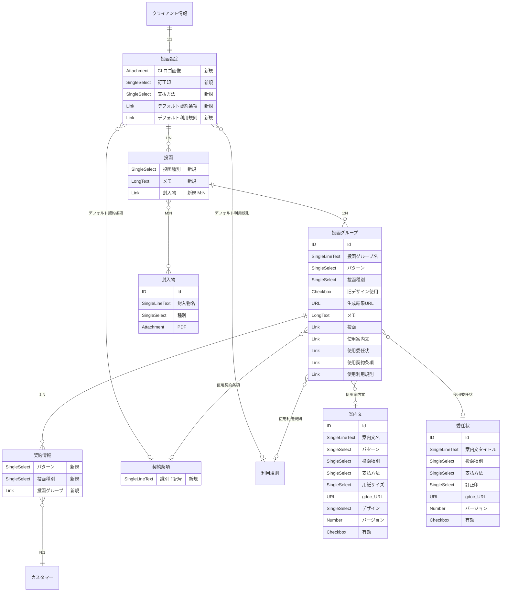

# 案内文FMT自動生成 スキーマ拡張ガイド

Dev 環境で 2026-04-16 に適用済み。本番適用時にこのドキュメントを参照する。

## ER図



## 変更サマリ

### 新規テーブル（4つ）

| テーブル | プライマリ表示 | 主なフィールド |
|---|---|---|
| 案内文 | 案内文名 | パターン, 投函種別, 支払方法, 用紙サイズ, gdoc URL, デザイン, バージョン, 有効 |
| 委任状 | 案内文タイトル | 投函種別, 支払方法, 訂正印, gdoc URL, バージョン, 有効 |
| 封入物 | 封入物名 | 種別, PDF |
| 投函グループ | 投函グループ名 | パターン, 投函種別, 旧デザイン使用, 生成結果URL, メモ |

### 既存テーブル追加フィールド

| テーブル | 追加フィールド | 型 |
|---|---|---|
| 契約条項 | 識別子記号 | SingleLineText |
| 投函設定 | CLロゴ画像 | Attachment |
| 投函設定 | 訂正印 | SingleSelect [あり, なし] |
| 投函設定 | 支払方法 | SingleSelect [通常, クレカNG（銀振OK）, 口振のみ] |
| 投函設定 | デフォルト契約条項 | Link → 契約条項 (bt) |
| 投函設定 | デフォルト利用規則 | Link → 利用規則 (bt) |
| 投函 | 投函種別 | SingleSelect [通常, 管理替え, N0, HW切替, いえらぶ切替, 物件付随_契約分離] |
| 投函 | メモ | LongText |
| 投函 | 封入物 | Link → 封入物 (mm) |
| 契約情報 | パターン | SingleSelect [なしなし, なしあり, ありあり] |
| 契約情報 | 投函種別 | SingleSelect [通常, 管理替え, N0, HW切替, いえらぶ切替, 物件付随_契約分離] |
| 契約情報 | 投函グループ | Link → 投函グループ (bt) |

### リンク関係（自動生成される逆リンク含む）

| 親テーブル | → | 子テーブル | リンク名（子側） | 型 |
|---|---|---|---|---|
| 投函 | hm | 投函グループ | 投函 | bt |
| 案内文 | hm | 投函グループ | 使用案内文 | bt |
| 委任状 | hm | 投函グループ | 使用委任状 | bt |
| 契約条項 | hm | 投函グループ | 使用契約条項 | bt |
| 利用規則 | hm | 投函グループ | 使用利用規則 | bt |
| 契約条項 | hm | 投函設定 | デフォルト契約条項 | bt |
| 利用規則 | hm | 投函設定 | デフォルト利用規則 | bt |
| 投函グループ | hm | 契約情報 | 投函グループ | bt |
| 投函 | mm | 封入物 | 封入物 | mm |

## prod 適用手順

### 前提

- CLI の v2 修正が含まれたビルド（`npm run build`）
- prod 用の profile（`node ./bin/noco-meta.js init` で作成するか `context` で base を切替）

### 手順

```bash
# 1. base を prod に切り替え
node ./bin/noco-meta.js context --base-id pzc3c5q5v13ioiz

# 2. 接続確認
node ./bin/noco-meta.js doctor

# 3. manifest の base.title を prod 用に変更（またはコマンドで上書き）
#    manifests/annai-fmt-extension.json の "title" を "データサクセス" に変更

# 4. dry-run
node ./bin/noco-meta.js plan manifests/annai-fmt-extension.json --api-version v2

# 5. 適用
node ./bin/noco-meta.js apply manifests/annai-fmt-extension.json --api-version v2

# 6. 投函グループ名フィールドを手動追加（manifest に含まれていない）
node ./bin/noco-meta.js request POST "/meta/tables/<投函グループのtable_id>/columns" \
  --body '{"title":"投函グループ名","uidt":"SingleLineText","pv":true}'

# 7. 適用後に dev に戻す
node ./bin/noco-meta.js context --base-id pd8jcg1sfga7g5q
```

### 注意事項

- **"Duplicate table alias" エラー**: 過去に同名テーブルを削除した場合、`nc_models_v2` にメタデータが残ることがある。DB で `SELECT * FROM nc_models_v2 WHERE title IN ('案内文','委任状','封入物','投函グループ')` を確認し、孤立レコードがあれば `DELETE` する。
- **冪等性**: apply は既存テーブル・フィールドをスキップするため、途中で失敗しても再実行可能。
- **投函グループ名**: manifest で作成されないので、apply 後に手動で追加する（上記手順 6）。
